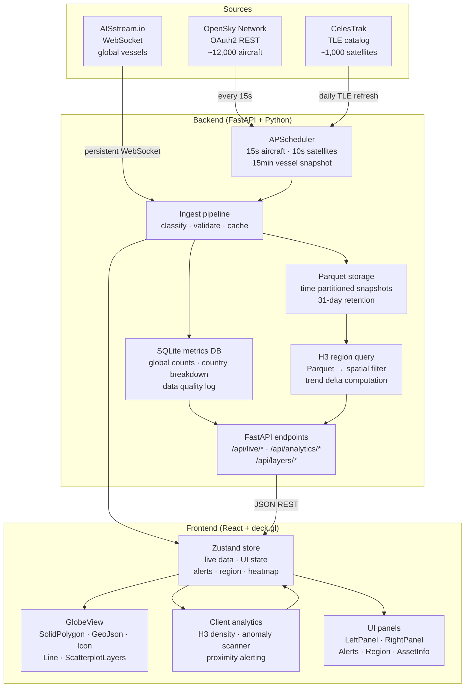

# SENTINEL

**Global asset tracking and analytics platform.** SENTINEL ingests real-time position data for aircraft, maritime vessels, and satellites from three independent sources, fuses them onto a single 3D globe, and applies a layered analytics pipeline ranging from live classification through to anomaly detection and regional density analysis.

The system is designed to demonstrate what is possible with open, public data sources — and to be honest about where those sources fall short.

---

## Architecture



---

## Data Sources

| Domain | Source | Method | Update rate | Key limitations |
|--------|--------|--------|------------|-----------------|
| Aircraft | [OpenSky Network](https://opensky-network.org) | OAuth2 REST | 15s | Anonymous rate limits; ADS-B coverage sparse outside Europe/US/Australia; military aircraft frequently suppress transponders or use civilian registrations |
| Vessels | [AISstream.io](https://aisstream.io) | Persistent WebSocket | Continuous | AIS is self-reported; military vessels routinely do not broadcast; spoofing is documented and detectable only probabilistically |
| Satellites | [CelesTrak](https://celestrak.org) | TLE HTTP catalog | Daily refresh, 10s propagation | TLE accuracy degrades with age; no sensor FOV data available; orbital manoeuvres not reflected until next TLE update |

Classification confidence is tracked per-asset and displayed in the UI. The system does not claim certainty it does not have.

---

## Analytical Depth

### Classification pipeline

Aircraft are classified using a three-layer priority system: ICAO 24-bit address ranges (high confidence for dedicated military blocks), callsign pattern matching (medium confidence), and ADS-B category codes (low confidence). The Russian Federation ICAO block `100000–1FFFFF` is treated as medium confidence rather than high because it covers both military and civilian registrations — Aeroflot falls within it. This kind of explicit policy decision is documented in the classifier and reflected in the per-asset confidence field.

Vessel classification uses ITU-R M.1371-5 AIS type codes. Military vessels are classified at medium confidence only — type code 35 is self-reported and frequently absent from genuine military traffic.

Satellite classification is the most reliable of the three: CelesTrak group membership is deterministic (a satellite in the `gps-ops` group is definitively a GPS navigation satellite), and name pattern matching catches the majority of known military designations.

### Storage and querying

Raw position snapshots are written to Parquet files partitioned by domain, date, and 15-minute window. This structure allows the H3 region query engine to load only the relevant time windows from disk rather than scanning the full dataset. A separate SQLite database stores pre-aggregated global and per-country counts, which the dashboard reads directly without touching the Parquet layer.

### H3 spatial indexing

Region queries use Uber's [H3](https://h3geo.org/) hexagonal hierarchical grid at resolution 3 (~12,100 km² per cell). When a user clicks the globe, the click coordinate is resolved to an H3 index in O(1), and asset containment is checked by hashing each asset's lat/lon to the same resolution and comparing indices — also O(1) per asset. This eliminates the need for Shapely point-in-polygon queries against arbitrary polygons, which would not scale to 24h × 96 snapshots × 12,000 assets. The same H3 infrastructure powers the client-side density heatmap, which computes live asset concentration per cell on every poll cycle using square-root normalisation to prevent hotspots from washing out moderate-density areas.

### Satellite visibility footprint

When a satellite is selected, SENTINEL renders its horizon footprint — the surface area from which the satellite is above the horizon, which is the geometric precondition for any line-of-sight contact. The footprint radius is derived from `ρ = arccos(R / (R + h))` where R is Earth radius and h is orbital altitude. Boundary points are computed via the haversine great-circle formula so the polygon is correct on a sphere at all latitudes. This scales correctly: a Starlink LEO satellite at 550 km shows a ~2,300 km radius footprint, a GPS MEO satellite at 20,200 km shows ~7,600 km. The footprint is explicitly labelled as a visibility footprint rather than a sensor footprint, because actual sensor field-of-view parameters are not publicly available for most satellites.

### Anomaly detection

SENTINEL uses rule-based anomaly flagging rather than statistical anomaly detection. This is a deliberate choice: a statistical approach requires a calibrated baseline, which would take weeks of continuous ingestion to establish and would still produce high false-positive rates given the noise characteristics of ADS-B and AIS data. Rule-based detection is immediately operational, fully explainable, and directly reflects domain knowledge.

Current rules:

| Rule | Domain | Threshold | Confidence | Rationale |
|------|--------|-----------|------------|-----------|
| Extreme altitude | Aircraft | > FL590 non-military | Low | Above normal civil ceiling; frequent in ADS-B noise |
| Supersonic speed | Aircraft | > 660 kts | Low | Above Mach 1 for civil; OpenSky speed data is noisy |
| Military no callsign | Aircraft | Military classification + empty callsign | Medium | Position visible, identity suppressed |
| Impossible speed | Vessel | > 50 kts | High | Physically unambiguous for surface vessels |
| Heading suppressed | Vessel | AIS sentinel 511 | Medium | Vessel broadcasting position but hiding heading |
| Stale TLE | Satellite | > 7 days old | High | Position error may exceed hundreds of km |
| Military proximity | Cross-domain | Military aircraft within 200 km of vessel | Medium | Depends on aircraft classification confidence |

Low-confidence rules exist to surface potentially interesting events while being explicit that ADS-B and AIS data contain genuine noise. The UI displays confidence per alert.

### GPU performance

With 12,000+ aircraft, naive full-array replacement on every poll cycle would force a complete GPU buffer upload every 15 seconds. SENTINEL uses delta merging: incoming aircraft records are diffed against the store by ICAO24 identifier and `last_contact` timestamp. Only records where `last_contact` has advanced are replaced; unchanged records preserve their object references. If no records changed, the store reference itself is unchanged and deck.gl's `useMemo` dependency does not fire, skipping the GPU upload entirely. On a typical OpenSky poll where ~25% of state vectors have updated positions, this reduces GPU upload work by approximately 75%.

---

## Stack

| Layer | Technology | Why |
|-------|-----------|-----|
| Backend | FastAPI + Python | Async-native, clean OpenAPI, works well with pandas/skyfield |
| Scheduling | APScheduler | Simple async job management; no broker dependency |
| Storage | Parquet + SQLite | Parquet for time-series analytical queries; SQLite for pre-aggregated dashboard data |
| Orbital propagation | Skyfield + SGP4 | Industry-standard TLE propagation; handles edge cases cleanly |
| Frontend | React + Vite | Standard; fast dev cycle |
| Globe | deck.gl GlobeView | WebGL instanced rendering; handles 12,000+ assets without custom shaders |
| State | Zustand | Minimal boilerplate; `getState()` escape hatch needed for non-React anomaly scanner |
| Spatial indexing | H3 (Python + JS) | Correct spherical geometry; O(1) containment check; well-established in geospatial engineering |

---

## Setup

### Requirements

- Python 3.11+
- Node.js 18+

### Backend

```bash
pip install -r requirements.txt
pip install h3

# Configure credentials
cp .env.example .env
# Edit .env:
#   OPENSKY_CLIENT_ID     — from opensky-network.org/index.php?option=com_opensky&view=credential
#   OPENSKY_CLIENT_SECRET — same
#   AISSTREAM_API_KEY     — from aisstream.io (free tier sufficient)

uvicorn backend.main:app --reload
```

### Frontend

```bash
cd frontend-app
npm install
npm install h3-js
npm run dev
```

Open `http://localhost:5173`. The backend proxies automatically via Vite.

### Regenerate military bases dataset

```bash
python scripts/generate_military_bases.py
```

This writes `backend/data/military_bases.json` from the curated static dataset. Run once after cloning.

---

## Usage

| Interaction | Action |
|-------------|--------|
| Rotate globe | Click and drag |
| Zoom | Scroll wheel |
| Focus asset | Click any aircraft, vessel, or satellite icon |
| Region analytics | Click empty globe space — selects H3 cell, queries 24h history |
| Satellite footprint | Click any satellite — shows visibility footprint disc |
| Orbit path | Click any satellite — shows propagated orbit for next ~95 minutes |
| Dismiss focus | Escape or click empty space |
| Heatmap | Left panel → Analytics section |
| Layer toggles | Left panel → Layers section |
| Alert panel | Bottom-left when anomalies detected |

---

## Limitations

These are stated honestly because domain reviewers will check.

**Aircraft coverage** is determined by ADS-B receiver density. Coverage over Africa, the Pacific, and polar regions is sparse. OpenSky's anonymous API rate-limits aggressively; the authenticated OAuth2 endpoint used here has higher limits but is still subject to server-side throttling. Military aircraft are systematically underrepresented — ADS-B transponders can be disabled, and many operate on military-only frequencies not captured by civilian receivers.

**Vessel coverage** via AIS has the same self-reporting problem at sea that ADS-B has in the air. Military vessels, submarines, and vessels engaged in activities they wish to conceal routinely do not broadcast, broadcast incorrect positions, or use spoofed MMSI numbers. The 30-minute staleness cutoff for live vessel display means slow-moving anchored vessels may disappear and reappear.

**Satellite positions** are propagated from Two-Line Elements using SGP4. TLE accuracy degrades with time and is affected by atmospheric drag (significant below ~600 km), solar radiation pressure, and untracked orbital manoeuvres. Position errors of tens to hundreds of kilometres are possible for TLEs more than a few days old. SENTINEL flags satellites with TLE age over 7 days in the anomaly panel.

**Classification accuracy** varies significantly by domain and confidence level. The ICAO hex range classifier for aircraft is the most reliable signal available from open data, but it is incomplete by design — many military aircraft operate outside known allocated ranges. Treat "military/medium" classifications as indicative, not definitive.

**Region analytics** depend on Parquet snapshot history. On a fresh installation, the 24-hour query window will return sparse results until sufficient history has accumulated. The data quality log (accessible via `/api/quality`) shows which snapshots were successfully received.

---

## Data Sources and Licensing

- **OpenSky Network** — [CC BY 4.0](https://opensky-network.org/about/terms-of-use). Attribution required.
- **AISstream.io** — free tier, terms at [aisstream.io/terms](https://aisstream.io/terms).
- **CelesTrak** — public domain TLE data. [celestrak.org](https://celestrak.org).
- **Military bases** — curated from OpenStreetMap contributors, [ODbL](https://www.openstreetmap.org/copyright). Coverage varies significantly by country and region.
- **Natural Earth** — public domain. Used for land and border geometry.
- **Submarine Cable Map** — [TeleGeography](https://www.submarinecablemap.com), used under fair use for non-commercial display.

---

*Built as a portfolio project demonstrating multi-domain geospatial data fusion, real-time analytical pipelines, and WebGL-based 3D visualisation.*